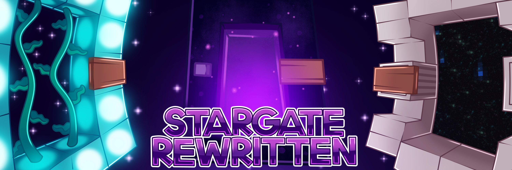

<br>
<div style="text-align: center;">
<h1>Stargate Gate Generator</h1><br>
<a href="https://cdn.sgrewritten.org/">Website</a><br>
<a href=""> Wiki</a><br>
<a href="https://sgrewritten.org/discord">Discord</a>
</div><br>

### An app that makes creating custom Stargate gates easier.

## Project Structure

- `app.py`: The main Flask application file that handles the backend logic.
- `templates/index.html`: The HTML template with the form and grid interface.
- `static/css/styles.css`: CSS file for styling the grid and form.
- `static/js/scripts.js`: JavaScript file for handling grid interactions.
- `static/images/`: Folder containing block textures (e.g., `stone.png`, `grass.png`).

## How to run it locally
#### Step 1 - Cloning the repository
Clone the repository using ```git clone https://github.com/axolotlagatsuma/Stargate-Gate-Creator-Web-App``` or downloading the zip and extracting it.

#### Step 2 - Installing packages
Open the terminal or Powershell to create a virtual environment (see [How to create virtual environments](https://docs.python.org/3/library/venv.html#creating-virtual-environments)) to activate the virtual environment run ```source /bin/activate``` after that run ```pip install -r requirements.txt```

#### Step 3 - Running the app
Now we'll do ```python app.py```

#### Step 4 - Done
This is not actually a step xD. Now go to http://{SERVERIP}:8000 probably http://localhost:8000

## To-do
### Phase 1
- Make the app work.

## Contributing
While Phase 1 is in place all help in writing code will be strongly appreciated.